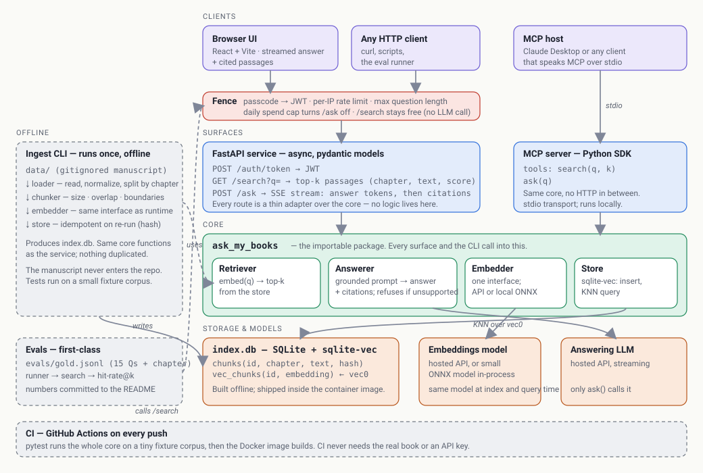

# ask-my-books

Ask questions of my technical book *No More Magic* and get answers with cited passages — a hand-built Python RAG service (FastAPI, SQLite + sqlite-vec, MCP) with a first-class eval set.

**Status:** in progress. Started September 2026; v1 targeted for October 2026. The roadmap at the bottom shows what's done and what's next.

## What it does

You ask a question in plain English. The service finds the passages of the book most relevant to it, asks a language model to answer *using only those passages*, and returns the answer together with the passages it drew on and the chapter each one came from. If the book doesn't support an answer, it says so instead of guessing.

Three ways to use it: an HTTP API, an MCP server (so an AI assistant can call it as a tool), and a small web UI that streams the answer as it's written.

## Architecture



The whole thing is one importable Python package, `ask_my_books`, with four parts: a **Retriever** (embed the question, pull the top-k chunks from the store), an **Answerer** (build a grounded prompt from those chunks and stream the answer with citations), an **Embedder** (one interface, whichever model sits behind it), and a **Store** (SQLite with the sqlite-vec extension holding both the chunk text and its vector).

Everything else is a thin way in: the FastAPI routes, the MCP tools, and the ingest CLI all call the same core and contain no logic of their own.

**Request path:** a question arrives at `/ask` → the fence admits it → the Retriever embeds it and pulls the top-k chunks from `index.db` → the Answerer builds a prompt from those chunks only → the LLM streams tokens back over SSE → citations follow the last token.

**Offline path:** manuscript → loader → chunker → embedder → store → `index.db`, built once on my machine and shipped inside the container image.

## Design decisions

| Decision | Why | Trade-off I'm accepting |
|---|---|---|
| `src/` layout with an editable install | Tests can only import the package through the install, so a green test proves the packaging works — not that a folder happened to be in the working directory | A little more setup than a flat layout |
| SQLite + sqlite-vec instead of a vector database | One file, no service to run, and the corpus is thousands of chunks, not millions. Brute-force nearest-neighbour is fast at this size | No horizontal scaling; re-indexing means rebuilding the file |
| Evals are a deliverable, not a stretch goal | A fixed set of questions with known source chapters turns "is retrieval better now?" into a number (hit-rate@k) instead of an opinion | The set is small and measures retrieval, not answer quality |
| The manuscript is never in the repository | The ingest CLI reads from a local, gitignored `data/` directory; tests run on a small fixture corpus; the built index ships inside the container image | Re-indexing means rebuilding the image — fine at this size |
| One Embedder used at index time and query time | Vectors in the index and the vector for a query must come from the same model, or retrieval silently degrades | The model choice is a one-way door once the index is built |
| A fence in front of the public `/ask` endpoint | It's a public endpoint that spends real money on every call: passcode, per-IP rate limit, question-length cap, and a hard daily spend cap. `/search` stays free because it never calls the LLM | Some friction for a first-time visitor |

## Evaluation

A gold set of 15 questions, each with the chapter that answers it. The runner sends each question through retrieval and counts a hit when the correct chapter appears in the top-k results. Numbers get committed here as the retrieval pipeline changes:

| Date | k | Hit-rate@k | Notes |
|---|---|---|---|
| — | — | — | first run pending |

## The corpus

The corpus is *No More Magic*, a full-length technical book I wrote. It isn't in this repository. The ingest CLI reads from a local `data/` directory that's gitignored, the test suite runs against a small fixture corpus, and CI never needs the real book or an API key.

## How I'm building this

I'm building this with an AI tutor in the loop — and a strict boundary.

Claude acts as teacher and reviewer. Before I build each piece, it explains the mechanism underneath it; after I build it, it reviews what I wrote and pushes back on my design decisions. What it doesn't do is write the code. Every line in this repository is typed by me, and each phase ends with me rebuilding its core piece from a blank file, from memory, and explaining it.

The point is a codebase I can defend line by line, built faster and better than I could alone. Documentation and diagrams under `docs/` are drafted with AI assistance and edited by me.

## Getting started

Requires Python 3.12 or newer.

```
git clone https://github.com/Whoisju1/ask-my-books.git
cd ask-my-books
python -m venv .venv
.venv\Scripts\Activate.ps1        # Windows — on macOS/Linux: source .venv/bin/activate
pip install -e ".[dev]"
pytest
```

## Roadmap

- [x] **P0 · Scaffold** — package layout, hatchling build, pytest smoke test
- [ ] **P0 · CI** — GitHub Actions running the test suite on every push
- [ ] **P1 · Ingestion** — loader, chunking, embeddings, SQLite vector store, ingest CLI
- [ ] **P2 · Retrieval + answers** — top-k search, grounded answers with citations, eval set and hit-rate@k
- [ ] **P3 · API** — FastAPI `/search` and `/ask`, OAuth2/JWT, tests
- [ ] **P4 · Ship** — MCP server, streaming React UI, Dockerfile, hosted demo, eval results above

## Stack

Python 3.12 · FastAPI · pydantic · pytest · SQLite + sqlite-vec · Python MCP SDK · React + Vite · Docker · GitHub Actions
